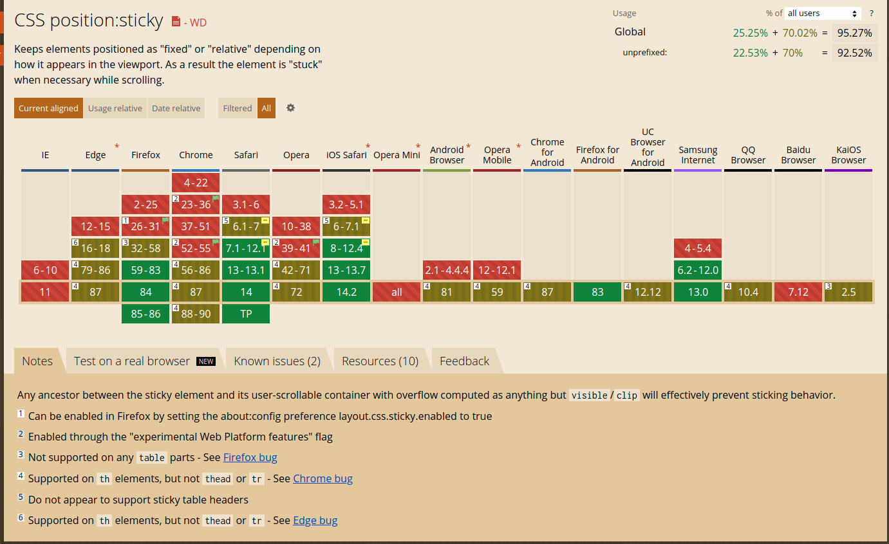
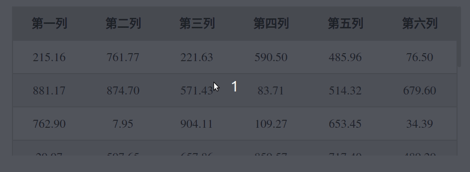
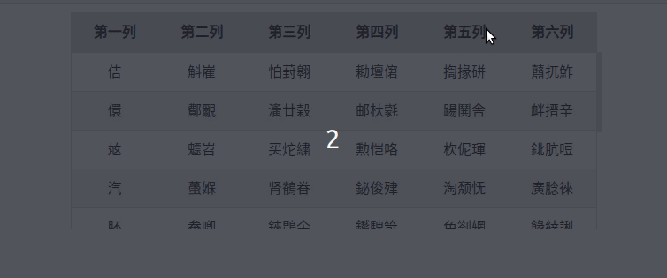
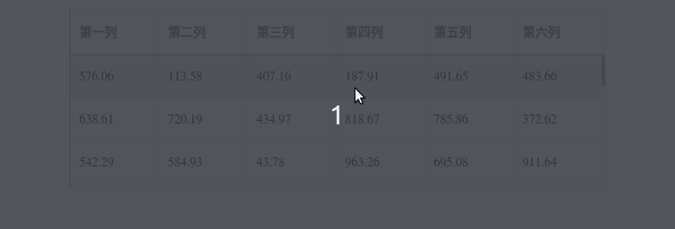

## table表头固定
### 1.纯css实现
    主要使用css的粘性定位position:sticky
    属性兼容性不是很好,具体如下:

效果图:

### 2.jQuery插件datatables实现
    datatables官网地址:https://datatables.net/
    使用datatables拓展fixedHeader,地址为:https://datatables.net/extensions/fixedheader/

效果图:

### 3.vue组件库elementUI实现
    用vue实现,官网地址:https://cn.vuejs.org/v2/guide/
    elementUI的table组件地址:https://element.eleme.cn/#/zh-CN/component/table

效果图:

    源码地址:https://github.com/snailsmail/snailsmail-blog/tree/develop

