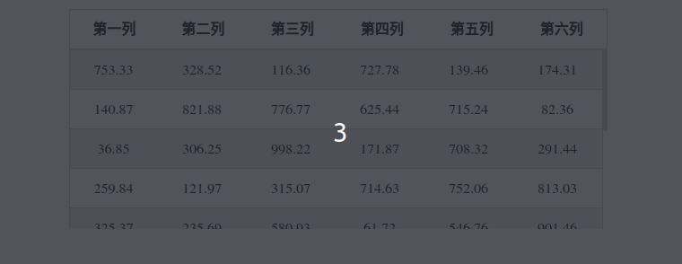

## table表头固定
### 1.纯css实现
    主要使用css的粘性定位position:sticky

    属性的兼容性具体如下:

<center>


</center>

    主要实现:

    给table中thead里的th添加position:sticky样式,需要设置top,left,right,bottom中的一个

    表头的背景色在滚动过程中是透明的,所以需要设置背景色.

效果图:

<center>


</center>

### 2.jQuery插件datatables实现

    表头固定主要是初始化datatable时,多添加三个配置属性,分别是:

```javescript
{
          scrollY: "200px",
          scrollX: true,
          scrollCollapse: true,
}
```

> 参考链接:
> [datatables官网地址](https://datatables.net/)
> [使用datatables拓展fixedHeader官网地址](https://datatables.net/extensions/fixedheader/)


效果图:

<center>


</center>

### 3.vue组件库elementUI实现

    组件中直接提供了表头固定的实现,直接使用.

> 参考链接:
> [vue官网地址](https://cn.vuejs.org/v2/guide/)
> [elementUI的table组件地址](https://element.eleme.cn/#/zh-CN/component/table)

效果图:

<center>


</center>

### 4.纯css另一种实现方式
    由datatables的表头固定启发到:
    一共两个table,一个只是用于于显示表头的,另一个是进行滚动的  
    用于滚动的table表头高度设为0,外层多包一层div,用于设置overflow-y:auto;  
    以及高度,可以让table进行滚动.  

    缺点:有一点的错位

<center>


</center>

