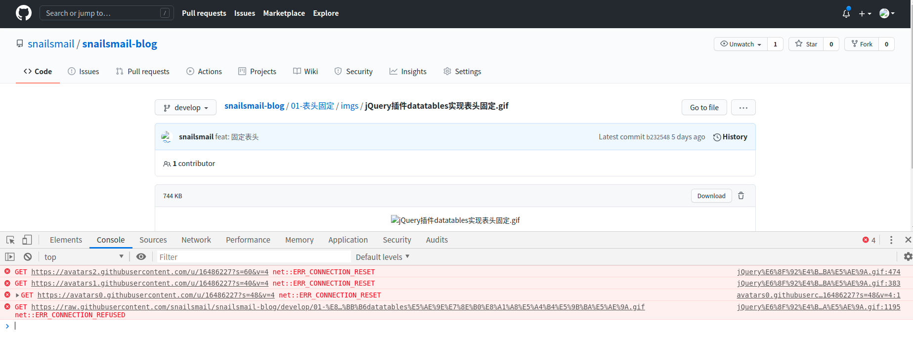
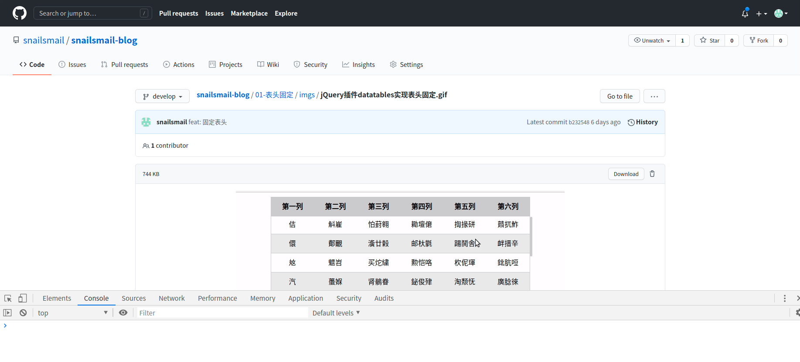

# github上图片不显示

### 1.出现的问题,图片不显示

<center>


</center>

### 2.需要通过修改hosts文件,明确指向github的ip地址绕过DNS解析

    首先查找hosts的文件路径:/etc/hosts 
```javascript
sudo find / -name filename 
```

    然后给hosts文件添加读写权限
```javascript
sudo chmod a+w filename
``` 

### 3.在hosts文件尾部添加以下文本
```javascript
# GitHub Start 
140.82.113.3      github.com
140.82.114.20     gist.github.com

151.101.184.133    assets-cdn.github.com
151.101.184.133    raw.githubusercontent.com
151.101.184.133    gist.githubusercontent.com
151.101.184.133    cloud.githubusercontent.com
151.101.184.133    camo.githubusercontent.com
151.101.184.133    avatars0.githubusercontent.com
199.232.68.133     avatars0.githubusercontent.com
199.232.28.133     avatars1.githubusercontent.com
151.101.184.133    avatars1.githubusercontent.com
151.101.184.133    avatars2.githubusercontent.com
199.232.28.133     avatars2.githubusercontent.com
151.101.184.133    avatars3.githubusercontent.com
199.232.68.133     avatars3.githubusercontent.com
151.101.184.133    avatars4.githubusercontent.com
199.232.68.133     avatars4.githubusercontent.com
151.101.184.133    avatars5.githubusercontent.com
199.232.68.133     avatars5.githubusercontent.com
151.101.184.133    avatars6.githubusercontent.com
199.232.68.133     avatars6.githubusercontent.com
151.101.184.133    avatars7.githubusercontent.com
199.232.68.133     avatars7.githubusercontent.com
151.101.184.133    avatars8.githubusercontent.com
199.232.68.133     avatars8.githubusercontent.com

# GitHub End
```

### 4.刷新github,图片加载出来了

<center>


</center>

##### [参考链接](https://www.jianshu.com/p/cca867f2b3d2)

##### [返回](https://github.com/snailsmail/snailsmail-blog)
##### [github上图片不显示－掘金地址](https://juejin.cn/post/6915212112662904845)


