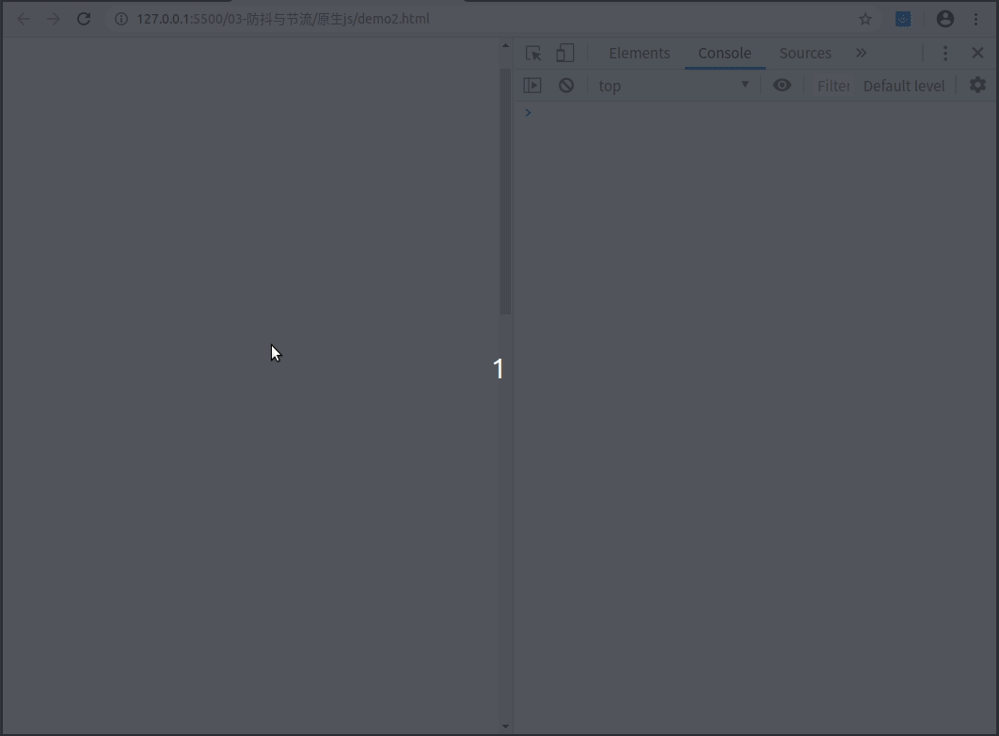

# 防抖与节流

### 1.出现问题

    一个函数被频繁触发,使页面出现抖动或卡顿的效果,使用户体验差.
    一般常见的问题,比如页面滚动,打印出当前top值:

```javascript
window.onload = function(){
    window.onscroll = function() {
        let scrollTop = document.body.scrollTop || document.documentElement.scrollTop
        console.log('滚定位置:' + scrollTop)
    }
}
```

效果图:


    滚动过程中实时显示滚动位置,对onscroll函数的调用频率太高了;那怎么处理这种高频调用?

### 2.解决办法

  #### 2.1.防抖

    单位时间内,对函数进行了多次调用,只最后一次有效.

  ```javascript
  /**
  * 防抖
  * @param fn 被调用的函数
  * @param delay 限制的时间段
  */
  function debounce(fn, delay) {
      let timer = null
      return function () {
          // 如果已经有个定时器,则删除掉,然后重新添加个定时器,保证在限制时间段内只有一个定时器
          if (timer) {
            clearTimeout(timer)
          }
          timer = setTimeout(function () {
              fn()
              timer = null
          }, delay)
      }
  }
  ```

效果图:



    滚动后停止1s后,打印出当前的滚动位置.

  #### 2.2.节流
    
    单位时间内,对函数进行多次调用,第一次有效.

  ```javascript
  /**
  * 节流
  * @param fn 被调用的函数
  * @param delay 限制的时间段
  */
  function throttle(fn, delay) {
      let valid = false // 记录状态
      return function () {
          // 第一次状态为false,先将状态变为true,保证以后调用直接return出去,然后添加定时器,定时器回调里执行需要执行的函数,并将状态改为初始状态
          // 定时器执行完成完成后,进入下一阶段的节流
          if (valid) {
              return false
          }
          valid = true
          setTimeout(function () {
              fn()
              valid = false
          }, delay)
      }
  }
  ```
  
    使用另一种实现方式:思路是一样的,也是使用一个标志性变量

  ```javascript
  /**
  * 节流
  * @param fn 被调用的函数
  * @param delay 限制的时间段
  */
  function throttle(fn, delay) {
      let timer = null 
      return function () {
          // timer为null时,直接执行被调用函数,然后添加定时器,在限制时间内timer一直有值,知道定时器回调执行,timer的值被重置,若再调用函数,则进入下一阶段的节流
          if (!timer) {
              fn()
          }
          timer = setTimeout(function () {
              timer = null
          }, delay)
      }
  }
  ```

效果图:


### 3.升级

    以上是防抖和节流的简单实现，若是被调用函数是需要传递参数的，需要考虑上下文环境和arguments的问题

```javascript
/**
 * 防抖
 * @param fn 被调用的函数
 * @param delay 限制的时间段
 */
function debounce(fn, delay) {
    let timer = null;
    return function () {
        let context = this
        let args = arguments
        if (timer) {
            clearTimeout(timer);
        }
        timer = setTimeout(function () {
            fn.apply(context, args);
            timer = null;
        }, delay);
    };
}

/**
 * 节流
 * @param fn 被调用的函数
 * @param delay 限制的时间段
 */
function throttle(fn, delay) {
    let timer = null 
    return function () {
        let context = this
        let args = arguments
        if (!timer) {
            fn.apply(context, args);
        }
        timer = setTimeout(function () {
            timer = null
        }, delay)
    }
}
```
    防抖被调函数的参数传递具体代码:

```javascript
window.onload = function () {
    function debounce(fn, delay) {
        let timer = null;
        return function () {
            let context = this
            let args = arguments
            if (timer) {
                clearTimeout(timer);
            }
            timer = setTimeout(function () {
                fn.apply(context, args);
                timer = null;
            }, delay);
        };
    }

    function scroll(a) {
        let scrollTop = document.body.scrollTop || document.documentElement.scrollTop;
        console.log("滚定位置:" + a + ' - ' + scrollTop);
    }

    let myScroll = debounce(scroll, 1000);

    window.onscroll = function(){
        myScroll('aa') // 被调用函数传递的参数
    };
};
```

效果图:


### 4.总结

    防抖：单位时间内，对函数进行了多次调用，只最后一次有效．
    节流：单位时间内，对函数进行了多次调用，只第一次有效．


### 参考
 https://segmentfault.com/a/1190000018428170