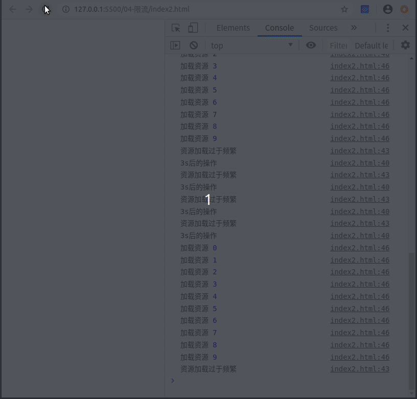

# 限流

### 1.背景

    系统中某功能页面上有多个点击操作，每个点击操作都是要向服务器端发起请求，并且系统中该功能的使用用户人数*N(>1000),存在高并发问题.

### 2.实现
    
    将学生比作前端发起的请求,将教室比作后端服务器,限流就是限制部分学生进入教室,也就是不允许某些请求到后端服务器.

    代码中需要三个变量以及一个方法:
        1. windowSize    限流的时间
        2. limitCount    限制的时间内,最多发起多少个请求
        3. resourcePool  限制的时间内,已发请求的时间戳
        4. tryAcquire    限制的时间内,判断是否可以发请求
    变量值根据业务需求来定．

核心代码:

```javascript
// 限流的时间 单位(毫秒)
let windowSize = 10 * 1000;

// 允许多少个请求
let limitCount = 10;

// 存储的时间戳 的资源池
let resourcePool = [];

let tryAcquire = function () {
    let currentTimeMillis = new Date().getTime();
    // 资源池未满
    if (resourcePool.length < limitCount) {
        resourcePool.push(currentTimeMillis);
        return true;
    }
    // 资源池 第一个过期了
    // 当前时间戳和资源池中第一个时间戳大于限流的时间,则资源池中第一个时间戳无效
    // 删除它并将当前的时间戳添加到资源池
    if (currentTimeMillis - resourcePool[0] > windowSize) { 
        resourcePool.shift();
        resourcePool.push(currentTimeMillis);
        return true;
    }
    return false;
}
```

### 3.测试

测试代码
```javascript
let count = 12;
setInterval(function () {
    console.log("3s后的操作");
    for (let i = 0; i < count; i++) {
        if (!tryAcquire()) {
            console.log("资源加载过于频繁");
            return false;
        }
        console.log("加载资源", i);
    }
}, 3000);
```

预测结果: 

    变量值是10s内可发10次请求,测试代码中,定时器3s执行一次;
    定时器第一次是3s(限制时间0s,第一次调用)后执行,for循环12次,前10次的加载资源正常显示,第11次,因为限流,所以显示了资源加载过于频繁,定时器第一次回调结束
    定时器第二次再3s(限制时间3s)后执行,for循环12次,因为限流,只显示了资源加载过于频繁,定时器第二次回调结束
    定时器第三次再3s(限制时间6s)后执行,for循环12次,因为限流,只显示了资源加载过于频繁,定时器第三次回调结束
    定时器第四次再3s(限制时间9s)后执行,for循环12次,因为限流,只显示了资源加载过于频繁,定时器第四次回调结束

    定时器第五次再3s(限制时间0s)后执行,重复定时器第一次回调...


### 4.测试结果

<center>


</center>

##### [返回](https://github.com/snailsmail/snailsmail-blog)
##### [限流－掘金地址](https://juejin.cn/post/6921621320832647181)
