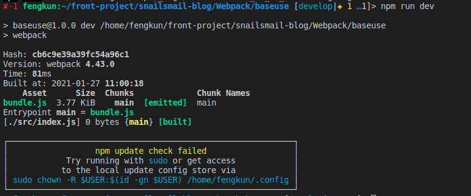
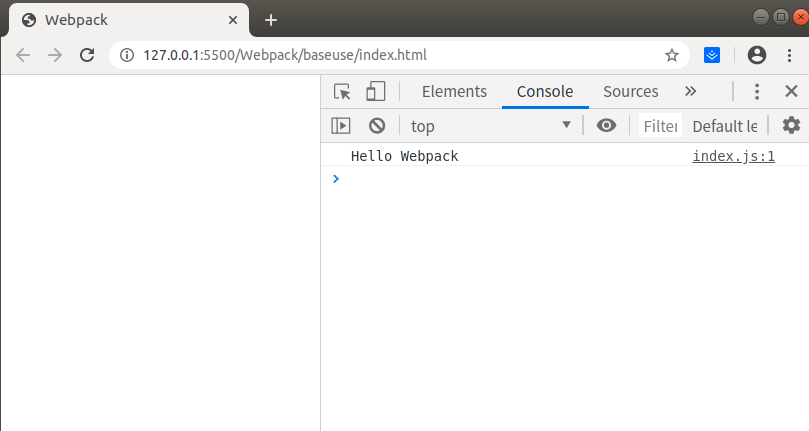

# 基础用法

使用 `wenpack4.x` 版本

### 1.步骤

- 创建文件夹 `baseuse`
- `npm init -y` 生成默认内容的 `package.json` 文件
- `npm install -D webpack@4.43.0 webpack-cli@3.3.12` 安装依赖
- 根目录下新建 `src` 文件夹,在 `src` 下新建 `index.js` 作为 `webpack` 的入口文件
- 根目录下新建文件 `webpack.config.js` 文件

```javascript
    const path = require('path')

    module.exports = {
        entry: './src/index.js' // 入口文件
        output: {
            path: path.resolve(__dirname, './dist'),
            filename: 'bundle.js'
        },
        mode: 'development' // none, development, production(default)
    }
```

- 在 `package.json` 文件中的 `script` 中添加属性 `"dev": "webpack"`,使用 `npm run dev` 进行打包

<center>


</center>

- 根目录下生成 `dist` 文件夹,以及 `bundle.js` 文件

### 2.测试

  根目录下新建 `index.html` ,并引入 `dist` 下的 `bundle.js` 文件

<center>


</center>

##### [返回](https://github.com/snailsmail/snailsmail-blog/tree/develop/Webpack%E7%B3%BB%E5%88%97)