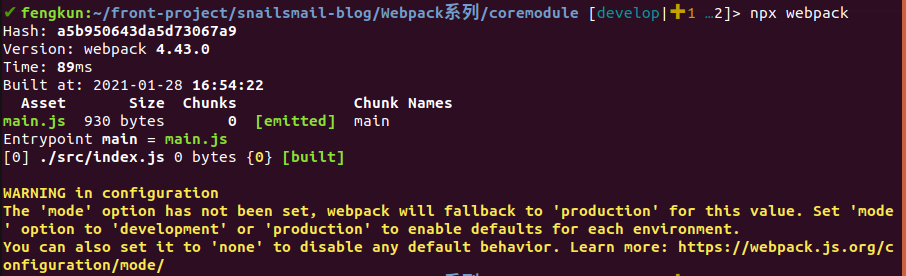
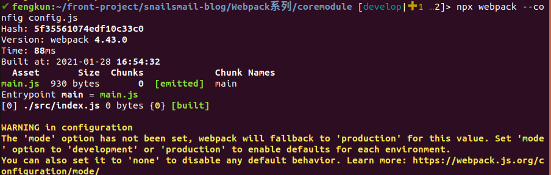
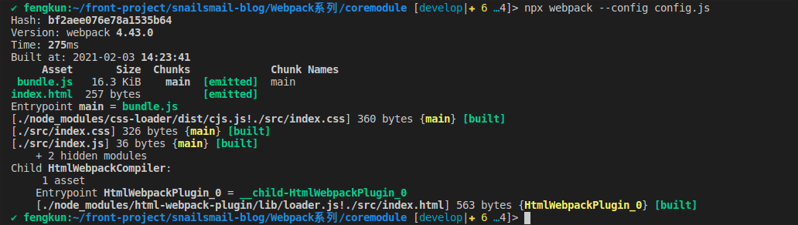
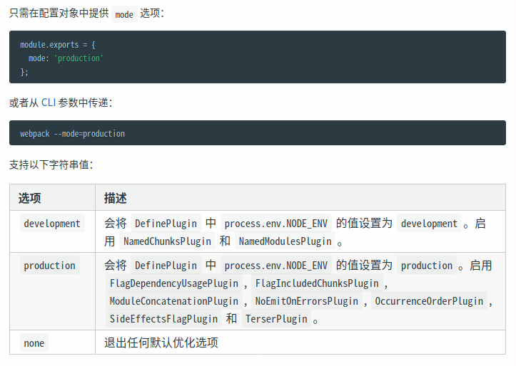

# 核心用法

### 1.零配置

- 创建文件夹 `coremodule`
- `npm init -y` 生成默认内容的 `package.json` 文件
- `npm install -D webpack@4.43.0 webpack-cli@3.3.12` 安装依赖
- 根目录下新建 `src` 文件夹,在 `src` 下新建 `index.js` 作为 `webpack` 的入口文件
- 使用 `npx webpack` 进行打包

<center>


</center>

注意:若 `src` 下没有 `index.js` 文件,则会报错,因为这是 `webpack` 默认的入口文件

    零配置只是最基础的配置项,一般项目都是需要自行添加配置的.

### 2.核心概念

[Webpack V4文档](https://v4.webpack.docschina.org/concepts/)

- **entry** 打包入口文件
- **output** 打包输出文件
- **loader** 模块解析
- **plugin** 插件
- **mode** 打包模式

### 3.分析及使用

#### 3.1.还原零配置内容

  根目录下创建文件 `webpack.config.js`,`webpack` 默认的打包配置文件是指向 `webpack.config.js` 的,若是不创建 `webpack.config.js` 文件,可在执行打包命令后添加 `--config xxx` 指向新的配置文件

  - 根目录下新建 `config.js`,并添加以下内容:

  ```javascript
    const path = require('path')

    module.exports = {
        entry: './src/index.js',
        output: {
            path: path.resolve(__dirname, './dist'),
            filename: 'main.js'
        }
    }
  ```

  - 使用 `npx webpack --config config.js` 进行打包

<center>


</center>

  打包结果信息零配置打包结果信息一致.

#### 3.2.entry

`webpack` 的入口起点,可指定多个或一个,默认值是 `./src/indexl.js`

```javascript
module.exports = {
  entry: './path/to/your/entry/file.js'
}
```

#### 3.3.output

`webpack` 的输出对象,指示 `webpack` 如何输出,那里输出,以及输出什么,默认值是 `./dist/main.js`,其它的生成文件默认放置在 `dist` 文件夹.

```javascript
const　path = require('path')

module.exports = {
  entry: './path/to/your/entry/file.js',
  output: {
    path: path.resolve(__dirname, 'dist'),
    filename: 'your-webpack.bundle.js'
  }
}
```

#### 3.4.loader

`webpack` 只能处理　`JavaScript` 和　`JSON` 文件，而 `loader` 可以让 `webpack` 能够处理其它类型的文件,并将它们转化为有效模块. `loader` 是在 `module` 里的  `rules` 属性中的,配置 `loader`需要两个必须属性:

  - `test` 属性,指定需要化的某类文件转换
  - `use` 属性,指定需要进行转换对应的loader

```javascript
const　path = require('path')

module.exports = {
  entry: './path/to/your/entry/file.js',
  module: {
    rules: [
      {
        test: '/\.(png|jpg)$/',
        use: 'file-loader'
      }
    ]
  }
}
```

#### 3.5.plugin

插件用于执行范围更广的任务,例如:打包优化,资源管理,注入环境变量.使用插件时,需要使用 `require()` 导入,并使用 `new` 来创建它的一个实例.
以 `html-webpack-plugin` 为例,在输出文件夹中自动生成 `index.html` 文件

  - 使用 `npm install -D html-webpack-plugin` 命令安装插件 
  - 在webpack配置文件中添加一下内容

```javascript
const HtmlWebpackPlugin = require('html-webpack-plugin')

module.exports = {
  entry: './path/to/your/entry/file.js',
  module: {
    rules: [
      {
        test: /\.css$/,
        use: ['style-loader', 'css-loader']
      }
    ]
  },
  plugins: [
    new HtmlWebpackPlugin({
      title: 'index页面',
      template: './src/index.html'
    })
  ]
}
```

打包结果:

<center>


</center>

输出文件夹中,会出现多个不是本次打包输出的文件,可使用 `clean-webpack-plugin` 来清除 `dist` 目录打包前遗留的文件,先在开发环境依赖中安装,然后在配置文件中添加一下代码:

```javascript
const { CleanWebpackPlugin } = require('clean-webpack-plugin') // 需要解构赋值

module.exports = {
  plugins: [
    new CleanWebpackPlugin()
  ]
}
```

#### 3.6.mode

  `webpack` 的打包模式,有 `none`, `development` 或 `production（默认）`。 

  <center>

  
  </center>


