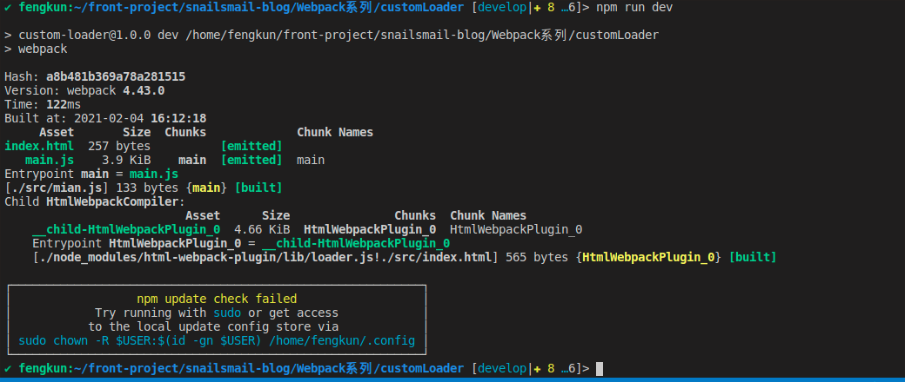
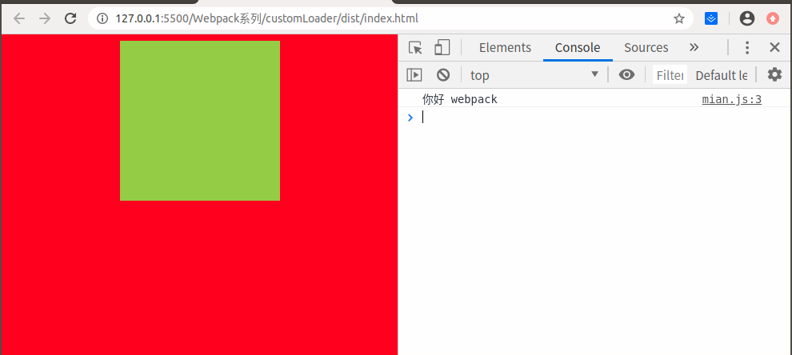
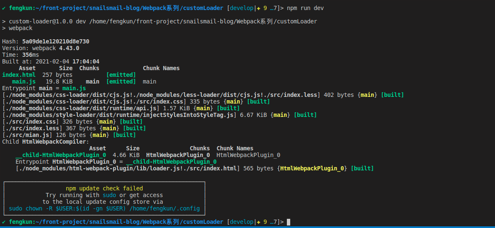

# 自定义loader

[自定义loader官网地址](https://v4.webpack.docschina.org/contribute/writing-a-loader)

### 1.准备工作

  - `npm init -y` 生成默认内容的 `package.json` 文件
  - `npm install webpack webpack-cli` 安装依赖
  <br/>

    **注意**:若是多人合作,提供相同的镜像源进行安装依赖的开发规范

    1.根目录下新建 `.npmrc` 文件,并添加以下内容:

    ```code
    registry=https://registry.npm.taobao.org
    ```

    2.使用命令行设置镜像源: `npm config set registry https://registry.npm.taobao.org`
    **推荐使用 `.npmrc` 文件方式**
  <br/>

  - 安装其它依赖

    ```bash
    npm install -D clean-webpack-plugin html-webpack-plugin
    ```

  ### 2.第一个自定义loader

  #### 2.1.匹配单个loader

  匹配单个 `loader` ,直接在use中使用 `path.resolve` 指向自己自定义的 `loader`
  写一个将入口文件中的 `hello` 转变为 `你好` 的功能

  **1.** 在 `src` 下新建 `my-first-loader.js` 文件,要遵循 `laoder` 的用法准则

  ```javascript
  module.exports = function (source) {
    return source.replace('hello', '你好')
  }
  ```

  **2.** 在 `webpack.config.js` 文件中添加以下内容:

  ```javascript
  const path = require('path')
  module.exports = {
    rules: [
      {
        test: '/\.js$/',
        use: path.resolve(__dirname, 'src/my-first-loader.js')
      }
    ]
  }
  ```

  **3.** 使用命令行 `npm run dev` 进行打包

<center>

  
</center>

  **4.** 访问 `dist` 文件夹下的 `index.html` 页面,查看效果

<center>

  
</center>

  #### 2.2.匹配多个loader

  匹配多个 `loader`, `webpack` 提供了 `resolveLoader.modules` 配置,将多个 `loader` 整体管理起来, `webpack` 在打包时会从该配置中检索对应的 `loader`

  写一个可解析 `less` 文件的功能

  ###### 2.2.1.使用npm提供的loader处理

  需要在开发环境下安装 `style-loader css-loader less less-loader`

  ```javascript
  module.exports = {
    rules: [
      {
        test: '/\.less$/',
        use: ['style-loader', 'css-loader', 'less-loader']
      }
    ]
  }
  ```

  `webpack` 处理 `less` 文件时,需要多个 `loader` 一起处理, 解析顺序是由后到前,会先执行 `less-loader`,再执行 `css-loader`,最后执行 `style-loader`.

  ###### 2.2.2.自定义loader处理

  ><mark>思路:</mark>在 `webpack` 执行时,碰到 `.less` 文件,先使用 `less-loader` 中的 `render` 方法,将 `less` 格式渲染成 `css` 格式,然后将 `css` 格式进行序列化,防止出现问题,最后将 `css` 添加到 `html` 页面的 `head` 中.

  **1.** 创建 `lib` 文件夹,整体管理 `loader` 文件,在 `lib` 文件夹中新建 `my-less-loader`

  ```javascript
  const less = require('less')

  module.exports = function (source) {
    less.render(source, (error, output) => {
      this.callback(error, output.css)
    })
    return // 当调用 callback() 时总是返回 undefined
  }
  ```

  `this.callback()` 参照 [loader API](https://v4.webpack.docschina.org/api/loaders/)

  **2.** 在 `lib` 文件夹中新建 `my-css-loader`

  ```javascript
  module.exports = function (source) {
    return JSON.stringify(source)
  }
  ```

  **3.** 在 `lib` 文件夹中新建 `my-style-loader`

  ```javascript
  module.exports = function (source) {
    return `
        const tag = document.createElement('style')
        tag.innerHTML = ${source}
        document.head.appendChild(tag)
    `
  }
  ```

  **4.** 打包结果

<center>

  
</center>

##### [返回](https://github.com/snailsmail/snailsmail-blog/tree/develop/Webpack%E7%B3%BB%E5%88%97)